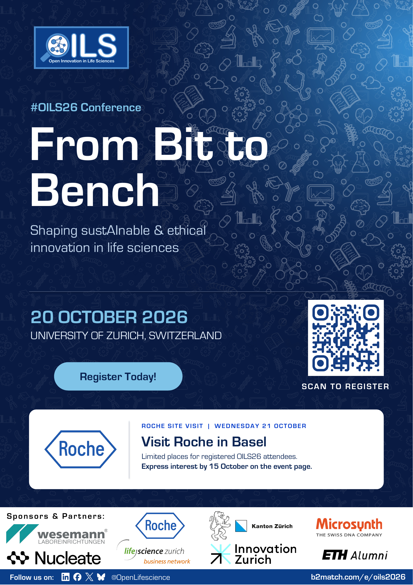
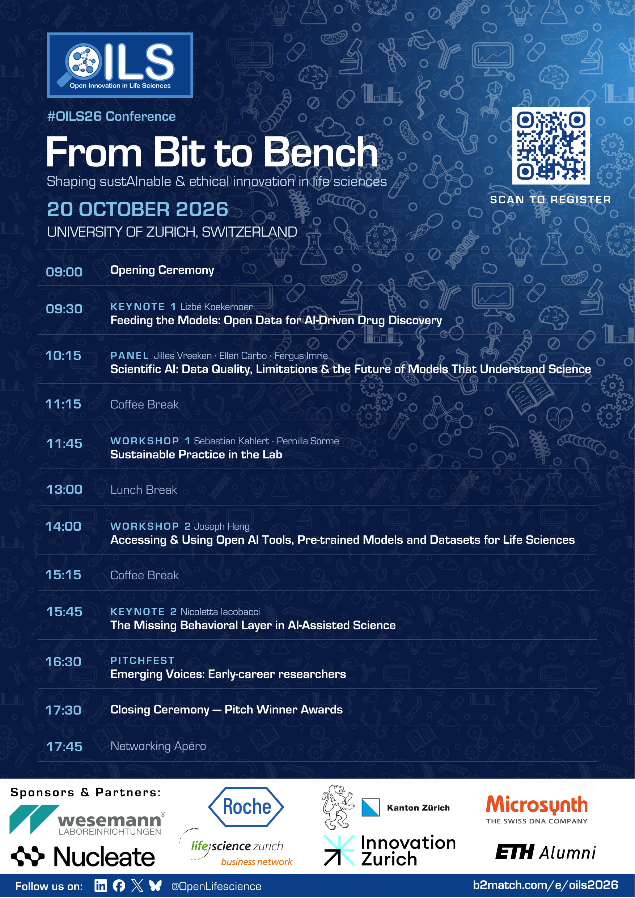

# OILS26 ETH screen ads

Ready-to-use graphics for ETH Campus Services screens:

| Channel | File | Size |
| --- | --- | --- |
| Portrait screens | [PNG](OILS26_ETH_vertical_1080x1920.png) · [editable SVG](OILS26_ETH_vertical_1080x1920.svg) | 1080 × 1920 px |
| ETH eLink bus screens | [PNG](OILS26_ETH_eLink_1920x1080.png) · [editable SVG](OILS26_ETH_eLink_1920x1080.svg) | 1920 × 1080 px |

Both ads feature the OILS26 conference on 20 October 2026, the Roche site visit on 21 October, and the sponsors and partners from the approved A3 poster. They direct viewers to [the event website](https://www.b2match.com/e/oils2026) for registration, the agenda, and visit details. The on-screen graphics use a readable URL instead of a QR code, following ETH Campus Services' digital-display recommendations.

## Approved poster references

The [final poster files](01_FINAL) show the complete print layouts and sponsor treatment. The PDFs are for printing; the PowerPoint files are editable.

| Poster | Print PDF | Editable PowerPoint |
| --- | --- | --- |
| Teaser A3 | [PDF](01_FINAL/OILS26_teaser_A3.pdf) | [PPTX](01_FINAL/OILS26_teaser_A3.pptx) |
| Agenda A3 | [PDF](01_FINAL/OILS26_agenda_A3.pdf) | [PPTX](01_FINAL/OILS26_agenda_A3.pptx) |
| Teaser A0 | [PDF](01_FINAL/OILS26_teaser_A0.pdf) | [PPTX](01_FINAL/OILS26_teaser_A0_editable.pptx) |

## Source files

- [Final logo and background assets](07_Codigo/A3_desde_Roche/assets) include the eight sponsor and partner logos used in the ads.
- [OILS brand resources](06_Recursos/marca) include the vector OILS logo and pattern artwork.
- [ETH screen generator](Logistica_ETH/build_eth_screens.py) builds the screen PNGs and SVGs from those assets. It was used on macOS with ImageMagick.
- The screen graphics follow ETH Campus Services' digital-display recommendations.

The PowerPoint files in `01_FINAL` are the reference for the final print layouts. The Python scripts in `07_Codigo/A3_desde_Roche` document earlier poster generation steps and may require archived inputs that are not part of this delivery.
